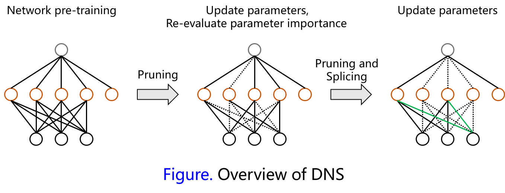

# DNS (Dynamic Network Surgery)

In this paper, the authors proposed dynamic network surgery to prune unimportant connections of the network. Different from previous methods, the proposed method contains two operations: **pruning** and **splicing**. Considering the complexity of deep neural networks, it is difficult to decide which connection is important and which one should be pruned. Thus the splicing operation is to recover the pruned weights that are found to be important during training phase. In contrary, weights are pruned with no chance to come back in previous methods, and that may lead to severe loss of accuracy.

## Pruning and Splicing

Suppose $$W_k$$ represents weights of a DNN model, and mask $$T_k(i,j)\in \{0,1\}$$ denotes the states of connections of network. The optimize object can be formulated as follows:
$$
\min_{W_k, T_k} L(W_k\odot T_k)~s.t. T_k^{(i, j)}=h_k(W_k^{(i, j)}), \forall (i,j)\in \mathcal{I}, \tag{1}
$$
where $$L(\cdot)$$ denotes the loss function, $$\odot$$ indicates the [Hadamard product operator](https://en.wikipedia.org/wiki/Hadamard_product_(matrices)), $$\mathcal{I}$$ represents every entry of weight matrixes and $$h_k(W_k^{(i,j)})$$ evaluates the importance of connections in the network. The definition of $$h_k$$ is shown as follows:
$$
h_k(W_k^{(i,j)}) = 
\begin{cases}
0 & if~a_k\gt|W_k^{(i,j)}| \\
T_k^{(i,j)}  & if~a_k\le |W_k^{(i,j)}| \lt b_k \\
1 & if~b_k\le |W_k^{(i,j)}|
\end{cases}\tag{2}
$$
$$a_k$$ and $$b_k$$ in Equation (2) are two thresholds for improving the robustness of the proposed method. Note that if $$|W_k^{(i,j)}|\in [a_k, b_k]$$, the state of $$T_k^{(i,j)}$$ would not be changed. This Equation is applied to the network to re-evaluate all the weights before training phase. Thus the pruned weights can be spliced if they are evaluated as important connections.

Further more, the thresholds $$a_k$$ and $$b_k$$ are computed by the following equations according to [source code](https://github.com/yiwenguo/Dynamic-Network-Surgery) on GitHub:
$$
a_k = 0.9*(mean(W_k)+cRate*std(W_k)),\\
b_k = 1.1*(mean(W_k)+cRate*std(W_k)), \tag{3}
$$
where $$cRate$$ is the factor deciding the compressing rate of the model. Larger $$cRate$$ leads to higher compression rate with more loss of accuracy.

After $$T_k$$ is obtained by Equation (2), we can train the network with full training phase and update weights $$W_k$$ with the following scheme:
$$
W_k^{i,j} \gets W_k^{(i,j)}-\beta \frac{\partial}{\partial(W_k^{(i,j)}T_k^{(i,j)})}L(W_k\odot T_k), \forall(i,j)\in \mathcal{I} \tag{4}
$$
Considering the convergence of the proposed method, the authors suggest that the frequencies of pruning and splicing can be slowed down with a monotonically non-increasing function $$\sigma(\cdot)$$ which indicates the probability of mask $$T_k$$ that to be modified in single training iteration. With amount of training iterations, the value of $$\sigma$$ may even decreased to zero, and the pruning and splicing to the network will be stopped.

### important tips

- The computation of thresholds only applied at the very beginning, and would not be change after that
- Considering the gradient vanishing problem, the authors prune convolutional layers and fully connected layers separately, which is similar to [Han's paper](http://papers.nips.cc/paper/5784-learning-both-weights-and-connections-for-efficient-neural-network.pdf)
- Pruned weights would also be updated during training

## Implementation in PyTorch

**Prepare: ** pre-train a DNN model

**Step 1, pruning and splicing: ** compute $$a_k$$ and $$b_k$$ by Equation (3) and update mask $$T_k$$ by Equation (2) with probability of $$\sigma(iter)$$

**Step 2, training: ** adopt forward and backward propagation and compute Loss and Gradient

**Step 3, updating: ** update weights of the model with mask $$T_k$$ using SGD

**Repeating: ** repeating step 1 to step 3 until the number of inter reaches its maximum

## Experimental Results

The authors conducted experiments on several models including LeNet-5, LeNet-300-100 and AlexNet. The experimental results can be summarized as follows:

| Model                   | Top-1 Error   | Parameters | Iterations | Compression    |
| ----------------------- | ------------- | ---------- | ---------- | -------------- |
| LeNet-5 reference       | 0.91%         | 431K       | 10K        |                |
| LeNet-5 pruned          | 0.91%         | 4.0K       | 16K        | 108$$\times$$  |
| LeNet-100-300 reference | 2.28%         | 267K       | 10K        |                |
| LeNet-100-300 pruned    | 1.99%         | 4.8K       | 25K        | 56$$\times$$   |
| AlexNet reference       | 43.42%/-      | 61M        | 450K       |                |
| AlexNet pruned          | 43.09%/19.99% | 3.45M      | 700K       | 17.7$$\times$$ |

More detail comparison with work of Han et. al. on AlexNet using single crop validation on ImageNet are shown as follows:

| Layer | Parameters | Remaining Parameters Rate of Han et. al.(%) | Remaining Parameters Rate(%) |
| ----- | ---------- | ---------------------------------------- | ---------------------------- |
| conv1 | 35K        | ~84%                                     | 53.8%                        |
| conv2 | 307K       | ~38%                                     | 40.6%                        |
| conv3 | 885K       | ~35%                                     | 29.0%                        |
| conv4 | 664K       | ~37%                                     | 32.3%                        |
| conv5 | 443K       | ~37%                                     | 32.5%                        |
| fc1   | 38M        | ~9%                                      | 3.7%                         |
| fc2   | 17M        | ~9%                                      | 6.6%                         |
| fc3   | 4M         | ~25%                                     | 4.6%                         |
| Total | 61M        | ~11%                                     | 5.7%                         |