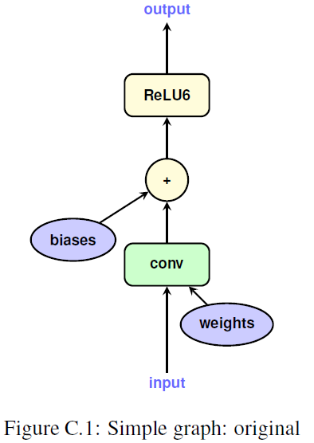
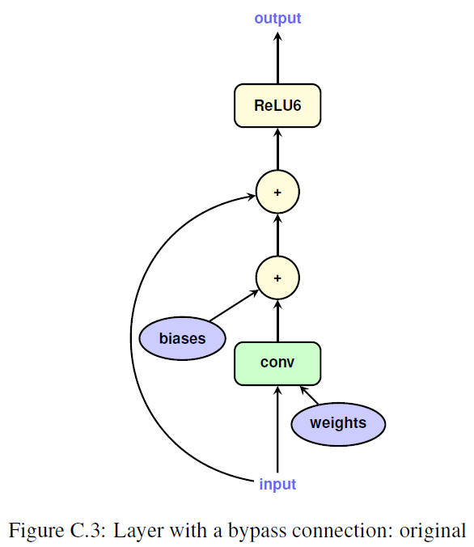

# Quantization and Training of Neural Networks for Efficient Integer-Arithmetic-Only Inference

**Paper**: https://arxiv.org/abs/1712.05877

**Code**: refer to TensorFlowLite.quantize

## Training with simulated quantization

### Point-wise quantization:

$$clamp(r;a,b) := min(max(r, a), b)$$

$$s(a,b,n) := \frac{b-a}{n-1}$$

$$q(r;a,b,n):=\lfloor \frac{clamp(r;a,b)-a}{s(a,b,n)} \rceil s(a,b,n)+a$$

Here, $r$ represents the real value, $q$ represents the quantized value. $\lfloor \cdot \rceil$ denotes rounding to the nearest integer.

- for weights: $a:=min(w), b:=max(w)$

- for activation: collect [a;b] during training and aggregate them via exponential moving average (EMA)


```
exponential moving average (EMA) in tensorflow:

shallow_variable -= (1-decay) * (shallow_variable-variable)

reasonable values for decay are close to 1.0, e.g., 0.999, 0.99999, etc
```

**Note: activation quantization is disabled at the start of training** 

### compute gradient

$$ \frac{\partial{L}}{\partial{r}} = \frac{\partial{L}}{\partial{q}}\frac{\partial{q}}{\partial{r}}$$

Here, we have $\frac{\partial{q}}{\partial{r}}=0$ if $r\notin[a,b]$, otherwise $\frac{\partial{q}}{\partial{r}}=1$.

## Inference with integer-arithmetic only

### Data type

- input: uint8

- weights: uint8

- bias: int32

- activation: int32

- output: uint8

### Affine mapping from q to r

Formulation:

$$ r = S(q-Z) \to q=\frac{r}{S}+Z$$

where $S$ means "Scale" and $Z$ means "Zero point". And $S=s(a,b,n), Z=z(a,b,n)$.

Therefore, considering $r_3=r_1*r_2$:

$$r_3 = S_3(q_3-Z_3), r_1*r_2=S_1S_2(q_1-Z_1)(q_2-Z_2)$$

$$q_3 = \frac{S_1S_2}{S_3}(q_1-Z_1)(q_2-Z_2)+Z_3$$

Let $M:=\frac{S_1S_2}{S_3}$ and $M=2^{-n}M_0$, $M_0\in(0.5,1]$.

For matrix multiplication of two matrices with size of $N\times N$.

$$q_3^{(i,k)} = Z_3 +M\sum_{j=1}^{N}(q_1^{(i,j)}-Z_1)(q_2^{(j,k)}-Z_2)$$

It needs $O(N^3)$ subtraction to compute the result. 

More efficient implementation:

$$q_3^{(i,k)} = Z_3 + M(\sum_{j=1}^N q_1^{(i,j)}q_2^{(j,k)}-\sum_{j=1}^N q_1^{(i,j)}Z_2-\sum_{j=1}^N q_2^{(j,k)}Z_1 + \sum_{j=1}^N Z_1Z_2)$$

$$q_3^{(i,k)} = Z_3 + M(\sum_{j=1}^N q_1^{(i,j)}q_2^{(j,k)}-Z_2 \bar a_1^{(i)}- Z_1a_2^{(k)} + N Z_1Z_2)$$,

where $\bar a_1^{(i)}:=\sum_{j=1}^N q_1^{(i,j)}$ and $a_2^{(k)}:=\sum_{j=1}^N q_2^{(j,k)}$. Therefore, the computational costs is mainly from the computation of $\sum_{j=1}^N q_1^{(i,j)}q_2^{(j,k)}$

### The Following operations

- scale down: int32 activation --> int8 output activation

- cast down: int8 activation --> uint8 output

### Batch normalization folding

$$ w_{fold}:=\frac{\gamma w}{\sqrt{EMA(\sigma_B^2)+\epsilon}}$$

### Graph illustration

#### simple graph for single layer

- origin



- quantized


#### layer with bypass

- origin



- quantized


#### convolutional layer with batch normalization

- training


- inference


- training with fold


- training with fold quantized


