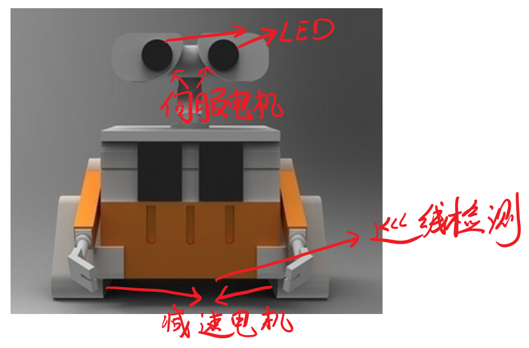
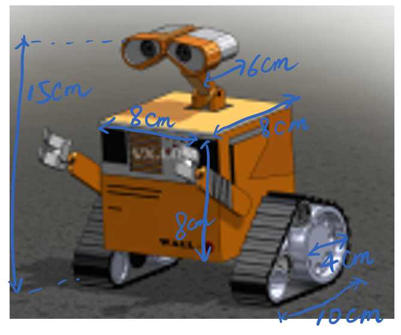
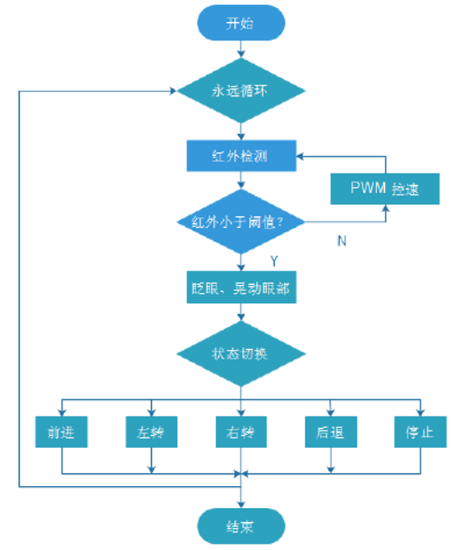
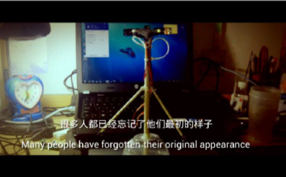
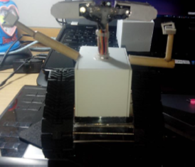
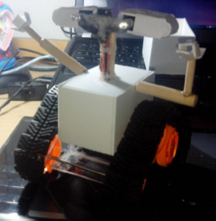

# 机器人瓦力设计
---

GitHub地址：https://github.com/ICEORY/WallyArduino

## 摘要

Arduino 作为一个开源的硬件平台，因为其使用门槛低以及使用方便的特点，受到了广大 DIY 爱好者的喜爱。许多开发者并不需要很好的硬件功底便可以利用该硬件平台进行电子硬件的设计，并实现酷炫的效果。本文主要介绍了一款基于Arduino mini 开发平台设计的智能机器人，并对该智能机器人的软件实现以及硬件设计做了详细的介绍。该款机器人具备了结构简单、趣味性强的特点，主要应用于机器人的教育领域。

本文根据电影《机器人总动员》中的主角瓦力的形象设计了一个能够自主运行的教育机器人，该机器人能够实现红外检测并根据红外检测的结果进行运动方式的切换。此外利用两个伺服电机设计了机器人的眼睛，使机器人能够实现眼部的运动，整体运行效果与机器人瓦力的效果相似。由于该机器人结构简单，运行效果非常有趣，很适合用于小学生的机器人课题教学。

## 系统概述

本课题主要基于 arduino mini 开发平台设计一个能够实现红外检测的履带式机器人。该机器人设计主要分为两大部分： 

1. 外观设计。该机器人采用机器人总动员中瓦力的外观，利用 KT 板或者安迪板切割进行构建，完成基本构架之后在表面上贴彩色的瓦力图像，机器人更加生动；该部分为本课题的重点，决定了整个作品的效果； 
2. 内部硬件设计。使用 arduino mini 进行硬件开发，传感器主要为红外传感器以及 LED，执行器为减速电机以及伺服电机；目标实现机器人能够进行自主的运动以及在检测到前方有障碍物时摇动眼睛。 

## 系统软硬件实现

### 整体实现方案

本课题主要根据电影《机器人总动员》中瓦力的形象进行外观的设计：使用伺服电机以及 LED 构造机器人的眼睛，使眼睛能够上下摆动以及闪烁；使用减速电机以及履带轮构造机器人的足部，实现瓦力自由行走的效果。系统设计方案如图所示：

结构设计：

运动方式：

尺寸设计：

### 硬件结构设计

瓦力内部控制硬件主要包括如下几个部分：

1. Arduino mini控制平台：作为中央控制器，负责对传感器数据的采集以及对执行机构的控制；
2. 减速电机：作为机器人的足部动力机构，带动三角形的履带转动，实现机器人的左转、右转、前进、停止；
3. LED：作为机器人的眼睛，能够判断前方是否有近距离障碍物；
4. 伺服电机：控制机器人眼睛的运动，瓦力的一个重要特征是两个眼睛能够晃动，非常有趣；

### 软件设计

软件部分按照状态机的方式进行设计，状态切换开关为机器人眼部的红外检测模块，每次检测到变化都对机器人的运行状态进行改变，依次变化为直走、左转、右转、后退、停止，同时眼部进行摆动，眨眼动作。软件结构框图如下所示： 

## 实物效果图

如下为搭建过程的效果以及最终的成果图： 

