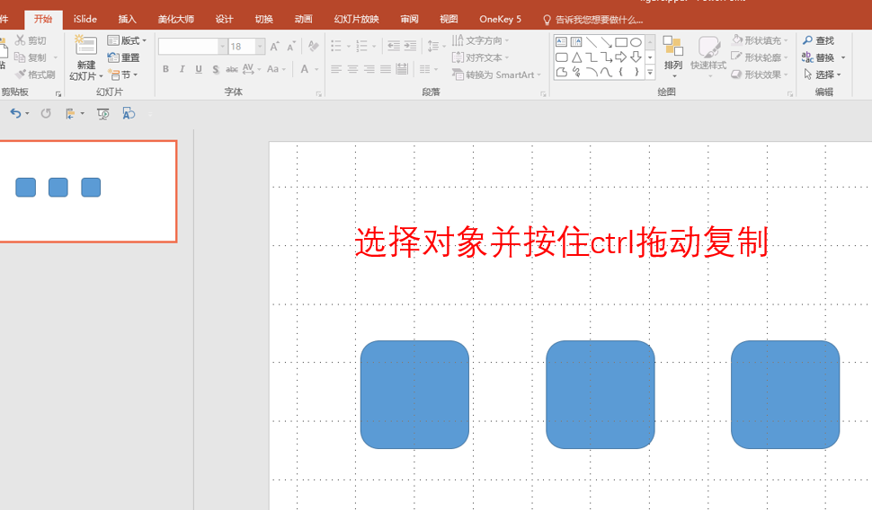
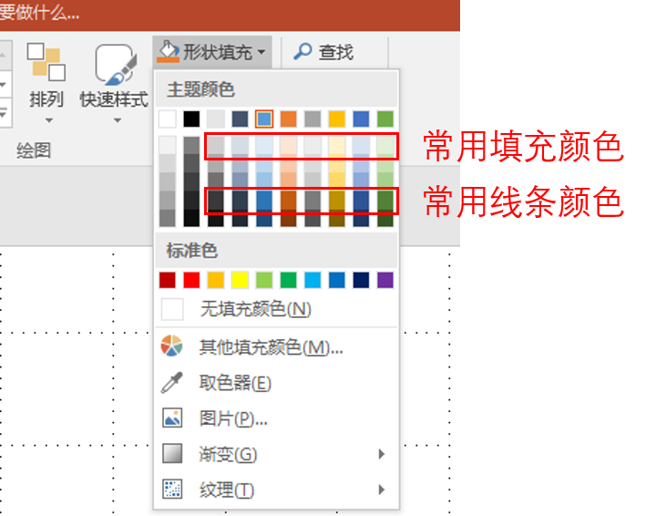
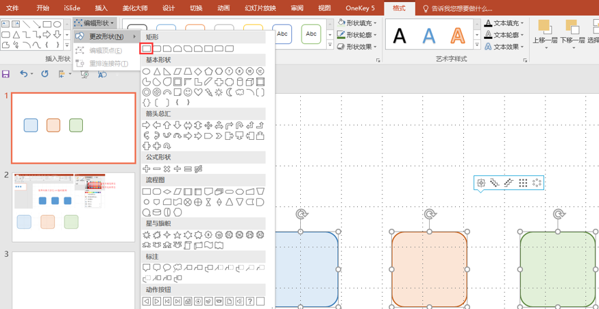
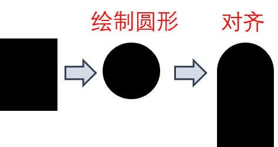
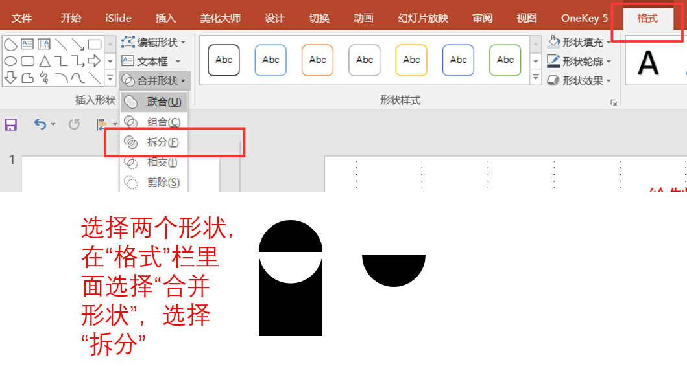
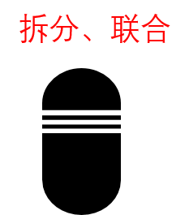
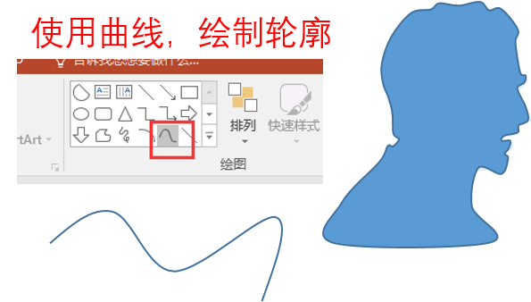
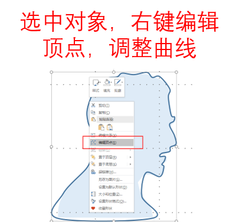
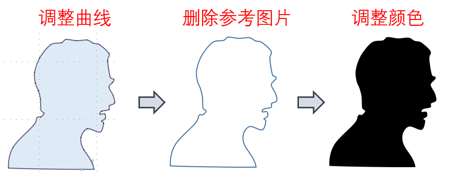
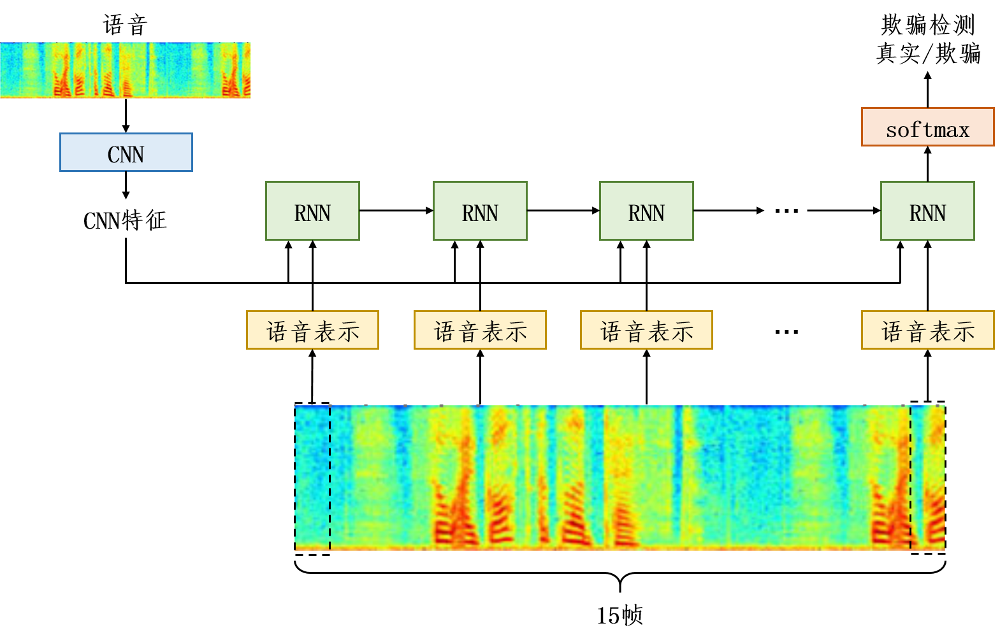

# PPT使用经验

---

## PPT可以做什么？

* 展示：海报、汇报等

* 美工：制作插图（矢量图）

* 修图：制作表情包等

## 插件

以下的插件都可以在网络上搜索获取，并很方便的插入到PPT里面使用。

1. **PPT美化大师**：这个用到的最多。主要使用对齐工具，不过会有广告，如有更好的插件请推荐。

2. OneKey Tools：一键统一图的大小、特效等。（偶尔用上）

3. iSlides：一键优化、PPT拼图等。（基本用不上）

## 关于PPT美化大师中广告的问题

答：在安装目录下寻找 minisite.exe 以及 notify.exe，编辑里面的内容使得这两个程序无效，或者新建一个txt文件，重命名为"minisite.exe"/"notify.exe"，替换掉这两个文件。然后设置文件的权限为只读（不然又会被恢复）。

## 画图规范

1. **不要嫌麻烦，尽量做好每个细节**；

2. **多练习；参考论文里面画的不错的图来练习**；

3. **想清楚图片要表示什么信息**；

4. 注意对齐。居中、左对齐、右对齐、等距分布等；可以在视图里面设置网格线方便对齐。

5. 线宽一般为1.5~2.0宽度。根据实际需要会有不同的变化；

6. 配色采用同种颜色的不同深浅搭配。

## 常用快捷键

1. 复制：选择对象，CTRL+鼠标拖动

2. 全选：CTRL+a

3. 格式刷：

   * 复制格式：CTRL+shift+c
   * 粘贴格式：CTRL+shift+v

4. 取消自动对齐：鼠标操作的基础上，按住alt

5. 按比例缩放图形：鼠标操作的基础上，按住CTRL

6. 按中心缩放图形：鼠标操作的基础上，CTRL+shift

---------------------内容分割线----------------------------------

## 简易教程

### 基本操作

1. 绘制基本的图形，选择对象并按住ctrl拖动复制

   

2. 改变线框为1.5，修改线条颜色以及填充颜色

   

   效果图：  
    

3. 快速改变形状：选择对象，在格式里面选择“编辑对象”，然后选择目标图形

   

   效果图：  
    

### 组合图形

1. 目标图形

   

2. 图形分析

   

3. 绘制基本图形

   

4. 合并图形操作： 选择对象（两个或者以上），在菜单栏“格式”里面选择“合并图形”，选择“拆分”

   

5. 联合两个半圆还有一个矩形，得到一个圆角矩形（虽然系统已经提供了这个形状，不过是以此为例子而已）

   

6. 使用矩形对圆角矩形进行分割

   

7. 继续使用上述操作，得到最终的目标

   

### 曲线绘制

1. 目标图形（接下来以此为参考对象绘制图形）

   

2. 使用曲线工具进行轮廓绘制，注意这里要绘制成封闭的图形

   

3. 选中曲线所绘制的轮廓，右键，选择“编辑顶点”

   

4. 继续调整，得到最终图形

   

## 例子参考

   

   

   

